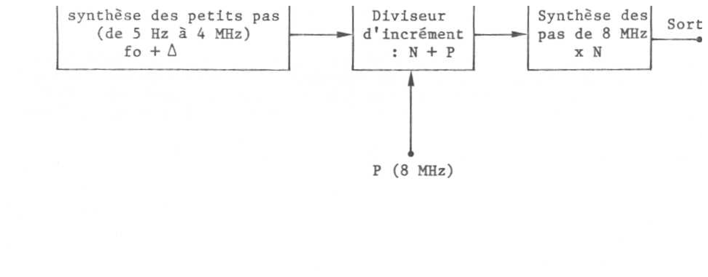
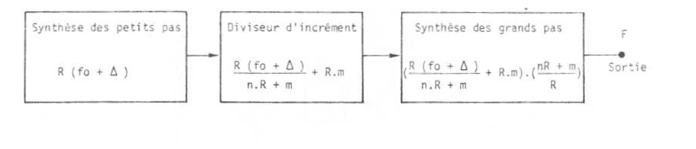
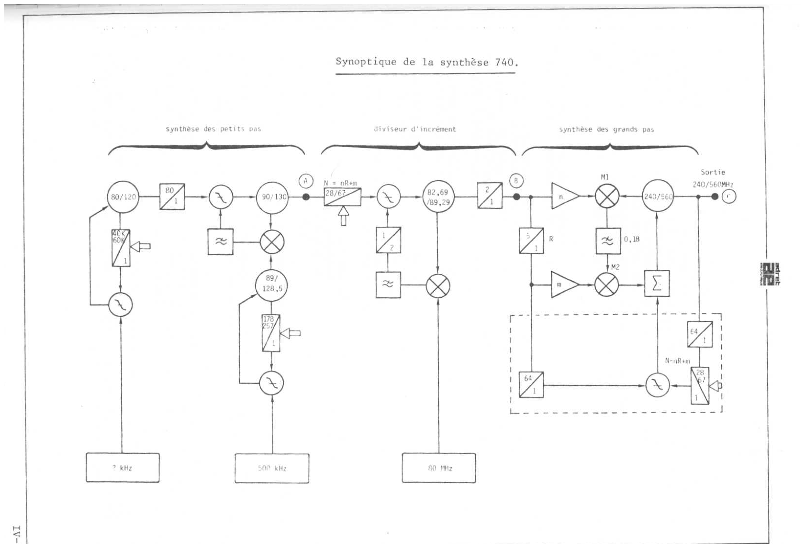
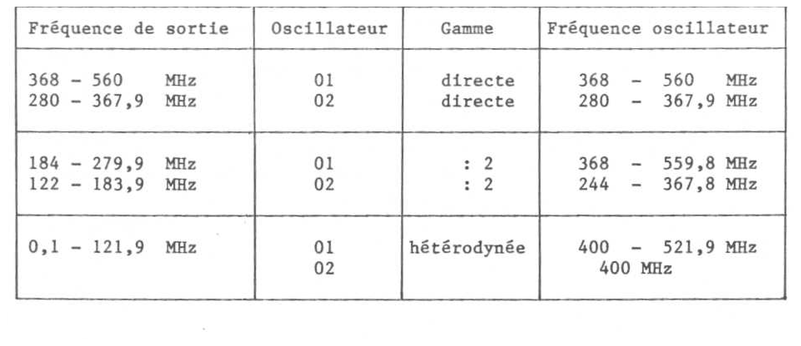

# ADRET 740 - Principe de fonctionnement

Source OCR : `Adret740A_principe.pdf`, chapitre IV, pages IV-1 a IV-10.

Note : le document d'origine est un scan. Le texte ci-dessous est une extraction OCR
relue et remise en forme. Les formules et les tableaux ont ete normalises lorsque
l'OCR etait ambigu.

## Schemas extraits

### Principe general



### Synoptique simplifie



### Synoptique de la synthese 740



### Gammes de sortie



## Principe general

Le generateur a synthese de frequence ADRET 740 met en oeuvre un procede
destine a obtenir une bonne purete spectrale tout en reduisant le nombre
d'elements necessaires dans les parties VHF.

Le procede breveté concerne la synthese des plus grands pas. Dans le 740,
ces grands pas valent 8 MHz.

Le principe simplifie comporte trois blocs :

1. une synthese des petits pas, de 5 Hz a 4 MHz, qui produit `fo + Delta` ;
2. un diviseur d'increment ;
3. une synthese des grands pas qui remultiplie le signal vers la sortie.

Le diviseur d'increment realise :

```text
(fo + Delta) / N + P
```

La frequence issue de ce diviseur est ensuite remultipliee par `N` :

```text
((fo + Delta) / N + P) x N = fo + Delta + N.P
```

Si `fo` est un multiple de `P`, la frequence de sortie est donc la somme :

```text
frequence petits pas + nombre de grands pas
```

Ce principe avait deja ete utilise sur le synthetiseur de frequence 6315
avec un pas `P = 40 MHz`. La particularite du 740 est d'abaisser le pas
apparent a 8 MHz, ce qui augmente le nombre de pas tout en evitant un taux de
multiplication excessif, defavorable a la purete spectrale.

## Generalisation appliquee au 740

L'idee consiste a faire fonctionner le synthetiseur des petits pas `R` fois
plus haut en frequence, et a introduire un terme `m` a la fois :

- dans la division de frequence du diviseur d'increment ;
- dans la remultiplication vers la sortie.

Le resultat donne :

```text
F_sortie = fo + Delta + n.P + m.P/R
```

Par rapport au principe du 6315, le terme `m.P/R` ajoute `R` positions
intermediaires pour un meme taux de multiplication `n`.

Pour le 740 :

```text
fo    = 18 MHz
Delta = 0 a 8 MHz
P     = 40 MHz
R     = 5
P/R   = 8 MHz
```

Le 740 part d'un oscillateur a quartz de 80 MHz. Il permet d'obtenir une
gamme directe de 240 a 560 MHz, et une gamme de 100 kHz a 560 MHz grace a
l'adjonction d'un diviseur et d'un melangeur pour la gamme heterodynee.

## Synthese des petits pas

La synthese des petits pas est realisee de facon classique au moyen de trois
boucles d'asservissement de phase.

La premiere boucle comporte :

- un oscillateur de 80 a 120 MHz ;
- un diviseur programmable de 40 000 a 60 000 ;
- un asservissement a 2 kHz.

Elle realise 20 000 pas de 2 kHz. Apres une division fixe par 80, la
frequence devient 1 a 1,5 MHz, avec un pas de 25 Hz.

Une deuxieme boucle additionne cette frequence a une frequence comprise entre
89 et 128,5 MHz. Cette derniere est fournie par une troisieme boucle qui
utilise :

- un oscillateur ;
- un diviseur programmable de 178 a 257 ;
- un asservissement a 500 kHz.

Elle genere 80 pas de 500 kHz.

La frequence somme au point `A` va donc de 90 a 130 MHz, avec une resolution
de 25 Hz. Cette valeur de pas est divisee par 5 vers la sortie, de meme que
le bruit et les raies parasites eventuelles. Le pas final correspondant est
donc de 5 Hz.

## Diviseur d'increment

La frequence issue de la synthese des petits pas est divisee par un taux :

```text
N = n.R + m
```

Dans l'appareil, ce taux varie pratiquement de 28 a 67.

Une boucle constituee de l'oscillateur 82,69 a 89,29 MHz, d'un melange avec
le 80 MHz de reference, d'un diviseur par 2 et d'un comparateur phase
frequence permet d'ajouter 80 MHz a deux fois la frequence issue du diviseur
28 a 67.

Apres division par 2, on obtient au point `B` :

```text
B = A / N + 40 MHz
```

## Synthese des grands pas et multiplication fractionnaire

La boucle de synthese des grands pas multiplie la frequence `B` par `N/R`,
soit environ de 5,6 a 13,4. Cela fait apparaitre un taux de multiplication
fractionnaire.

Cette multiplication fractionnaire est realisee d'une maniere particuliere
pour eviter la degradation du rapport signal/bruit.

Le signal `B` est transforme en peigne de frequences puis melange avec la
frequence de l'oscillateur de sortie. Une boucle d'approche, comportant deux
diviseurs fixes par 64 et un diviseur variable par `N = n.R + m`, positionne
d'abord l'oscillateur sur la bonne frequence. L'asservissement fin assure
ensuite la purete spectrale.

Deux cas sont decrits :

1. `N/R` est entier. Une raie du peigne est egale a la frequence de
   l'oscillateur. Le melangeur `M1` donne un battement nul. Le melangeur `M2`,
   du type a echantillonnage, recopie la composante continue qui asservit
   directement l'oscillateur.
2. `N/R` n'est pas entier. Un battement apparait entre l'oscillateur et la
   raie du peigne la plus proche. Ce battement vaut `B/5` ou `2B/5`, avec un
   signe positif ou negatif selon que l'oscillateur est au-dessus ou au-dessous
   de la raie du peigne.

Il existe ainsi cinq positions d'asservissement possibles :

```text
-2B/5, -B/5, 0, B/5, 2B/5
```

Ces cinq positions donnent cinq pas entre chaque pas de 40 MHz, soit une
resolution de 8 MHz, avec un taux de multiplication maximum d'environ 14 par
rapport a la frequence `B`.

## Exemple numerique : 543,21 MHz

Le CPU calcule le taux de division `N` du diviseur d'increment en prenant la
partie entiere du quotient de la frequence de sortie demandee, apres
soustraction de `fo = 18 MHz`, par le pas de 8 MHz :

```text
N = int((F_sortie - 18) / 8)
```

Pour `F_sortie = 543,21 MHz` :

```text
N = int((543,21 - 18) / 8) = 65
reste = 5,21 MHz
```

Le reste correspond a `Delta`. La frequence au point `A` est donc :

```text
A = R x (fo + Delta)
A = 5 x (18 + 5,21)
A = 116,05 MHz
```

Apres le diviseur d'increment :

```text
B = A / N + 40
B = 116,05 / 65 + 40
B = 41,785385 MHz
```

La boucle d'approche compare la frequence `B`, apres division par 5 puis par
64, a la frequence de l'oscillateur divisee par 64 :

```text
B / 5 / 64 = 41,785385 / 5 / 64 = 0,130579 MHz
```

Le compteur de la boucle d'approche divise par 65, ce qui donne :

```text
0,130579 x 65 x 64 = 543,21 MHz
```

Pour la boucle d'asservissement fin, le peigne de frequence issu de `B`
contient notamment :

```text
41,785385 x 13 = 543,21 MHz
```

Le battement en sortie de `M1` est donc nul. `M2` recopie la composante
continue et asservit directement l'oscillateur. C'est le cas simple d'un taux
de multiplication entier.

## Exemple numerique : 401 MHz

Pour `F_sortie = 401 MHz` :

```text
N = int((401 - 18) / 8) = 47
reste = 7 MHz
```

Donc :

```text
A = 5 x (18 + 7) = 125 MHz
B = 125 / 47 + 40 = 42,65957 MHz
```

La boucle d'approche positionne l'oscillateur a 401 MHz. Le peigne issu de
`B` donne par exemple :

```text
42,65957 x 9 = 383,9361 MHz
```

Le melangeur `M1` donne alors un battement :

```text
401 - 383,9361 = 17,0638 MHz
```

Ce battement est echantillonne dans `M2` a :

```text
B / 5 = 42,65957 / 5 = 8,5319 MHz
```

Le battement vaut donc `2 x B/5`. L'asservissement s'effectue sur
l'harmonique 2 de la frequence d'echantillonnage.

## Explication du synoptique

La synthese des petits pas met en oeuvre deux cartes :

- la premiere genere 20 000 pas ;
- la seconde genere 80 pas.

La carte dite "vingtmillade" comporte un oscillateur 80 a 120 MHz asservi a
2 kHz a travers un diviseur 40 000 a 60 000. Un diviseur fixe de sortie
ramene la frequence a 1 - 1,5 MHz et la valeur du pas a 25 Hz, soit cinq
fois celle necessaire en sortie.

La carte dite "quatrevingtade" comporte deux oscillateurs. Le premier, de
89 a 128,5 MHz, realise 80 pas de 500 kHz au moyen du compteur 178 a 257 et
de l'asservissement a 500 kHz.

La frequence 1 - 1,5 MHz comportant les petits pas lui est ajoutee au moyen
du deuxieme oscillateur et d'une boucle d'asservissement. La sortie 90 a
130 MHz represente la synthese des petits pas et sera divisee par 5 vers la
sortie.

La synthese des grands pas reprend le diviseur d'increment divisant les
petits pas par `N`, avec l'oscillateur 82,69 a 89,29 MHz qui fournit deux
fois la frequence `B`, ensuite remultipliee pour obtenir la frequence de
sortie.

Deux oscillateurs de sortie sont utilises afin que chacun ne couvre qu'un
rapport de frequence raisonnable, et afin de realiser la gamme heterodynee
permettant de descendre a 100 kHz.

## Gammes de frequence

L'utilisation des oscillateurs `O1` et `O2`, de commutateurs HF et d'un
diviseur par 2 permet d'obtenir une gamme continue de 100 kHz a 560 MHz.

| Frequence de sortie | Oscillateur | Gamme | Frequence oscillateur |
| --- | --- | --- | --- |
| 368 - 560 MHz | O1 | directe | 368 - 560 MHz |
| 280 - 367,9 MHz | O2 | directe | 280 - 367,9 MHz |
| 184 - 279,9 MHz | O1 | /2 | 368 - 559,8 MHz |
| 122 - 183,9 MHz | O2 | /2 | 244 - 367,8 MHz |
| 0,1 - 121,9 MHz | O1 | heterodynee | 400 - 521,9 MHz |
| 0,1 - 121,9 MHz | O2 | heterodynee | 400 MHz |

Pour les gammes directes et divisees, l'oscillateur utilise est toujours
asservi par le dispositif de multiplication fractionnaire partant de
l'oscillateur 82 a 89 MHz.

Pour la gamme heterodynee, `O1` est asservi de la meme maniere, tandis que
`O2` est asservi a 400 MHz directement a partir du 80 MHz du pilote, par un
circuit independant comportant aussi une boucle d'approche. Le battement
entre les deux oscillateurs fournit la frequence de sortie.

## Modulations et attenuateur

Le modulateur AM est place de facon a etre sur le chemin du signal dans tous
les cas. En gamme heterodynee, il agit sur la voie lineaire du melangeur.

Un interrupteur HF precede le modulateur AM et permet la modulation
d'impulsion.

La modulation de frequence est realisee sur la carte "FM" au moyen d'un
oscillateur a 80 MHz asservi avec une bande de 5 Hz. Cet oscillateur recoit
dans sa boucle le signal de modulation FM, ou sa derivee dans le cas de la
modulation de phase. En mode FM ou PM, cette oscillation est envoyee vers le
diviseur d'increment a la place du 80 MHz du pilote.

Les circuits diviseur et filtre qui elaborent les frequences de modulation
400 Hz et 1 kHz sont situes sur la meme carte.

La carte "analogique" assure le dosage des signaux de modulation AM, FM et
PM au moyen d'un DAC BCD. Un deuxieme DAC assure, pour les modulations de
frequence et de phase, la compensation du taux de multiplication variable
`N` intervenant entre le diviseur d'increment et la sortie.

La reference de niveau RF, utilisee pour les pas de 0,1 et 1 dB qui
interpolent entre les pas de 5 dB de l'attenuateur, est egalement realisee
sur la carte analogique par un reseau pondere commute par commutateur CMOS.

La carte approche contient :

- les boucles d'approche `O1` et `O2` avec un diviseur variable 28 a 67 ;
- la boucle d'approche de l'oscillateur `O2` a 400 MHz fixe ;
- les registres et circuits de commande du module VHF et de l'attenuateur.

## Pilote, logique et bus

Le pilote a quartz fournit un 80 MHz tres pur et comporte un diviseur par 8
qui produit le 10 MHz de reference.

La partie logique du 740 est constituee de deux sous-ensembles :

- une carte CPU ;
- une carte face avant.

L'organisation de la carte CPU est particuliere en raison de l'isolement des
bus. Trois bus sont distingues :

| Bus | Role |
| --- | --- |
| Bus microprocesseur | Relie le microprocesseur a ses peripheriques et commande le bus instrument a travers des registres. |
| Bus IEEE | Lie au microprocesseur par un circuit d'interface 68488, sans isolement galvanique par rapport au bus microprocesseur. |
| Bus instrument | Commande les differents modules du 740 et comporte un isolement galvanique par photocoupleurs. |

Ainsi, l'ensemble de la partie logique est flottant et l'isolement est
realise au niveau du bus instrument. La face avant, qui comporte le clavier
et les affichages, est reliee au microprocesseur par un PIA.
