Le panneau arrière comporte de droite à gauche :

- la prise de programmation bus IEEE 488,
- la prise auxiliaire permettant de faire défiler les mémoires,
- la prise secteur normalisée, le répartiteur secteur et le fusible,
- la prise BNC d'entrée asservissement,
- la prise BNC de sortie référence 10 MHz 0,5 V eff. / 50 ohms,
- une prise de sortie RF délivrant un niveau d'environ -15 dBm.

### III 3. MANIPULATION DU CLAVIER

### MODE OPERATOIRE

Le 740 A possède une mémoire permanente et, lors de la mise sous tension, retrouve la configuration qu'il avait au moment de la coupure.

Cependant, pour éviter des erreurs en cas de changement d'utilisateur, les fonctions spéciales sont oubliées à chaque interruption de fonctionnement.

Afin de rendre la manipulation aussi aisée que possible, de permettre les corrections et d'éviter les erreurs ou les transitoires parfois dangereux pour les circuits sous test, il est prévu une touche "EXECUTE".

L'utilisation du clavier est représentée par le diagramme de la page III.5

Cette disposition permet notamment :

- de passer d'une configuration A à une configuration B sans configuration intermédiaire indésirable.
- de vérifier la totalité des données entrées avant d'exécuter.
- de rappeler les mémoires et de les contrôler avant d'exécuter.

Pendant l'entrée des nouvelles données, une touche "X<->Y" permet d'obtenir temporairement sur l'affichage la configuration actuelle, c'est-à-dire celle de sortie.

Le voyant situé au-dessus de la touche "EXECUTE" s'allume lors de l'entrée d'une donnée, dès le premier chiffre, et clignote après l'entrée de l'unité, invitant ainsi l'utilisateur à exécuter.

Si un deuxième paramètre doit être entré ou modifié, la diode s'allume de nouveau en continu et clignote de même après la frappe de l'unité, et ainsi de suite pour d'autres paramètres.

L'allumage ou le clignotement attire l'attention de l'utilisateur sur le fait que l'affichage concerne une entrée en cours et non la configuration de sortie active.

### Diagramme de l'utilisation du clavier

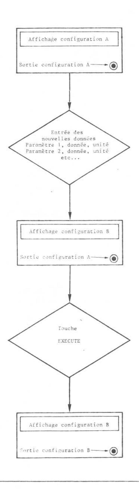

### PROGRAMMATION DE LA FREQUENCE ET DU NIVEAU

### Exemples:

\* Une fréquence RF avec un niveau donné en dBm : soit 543,21 MHz, -33 dBm.

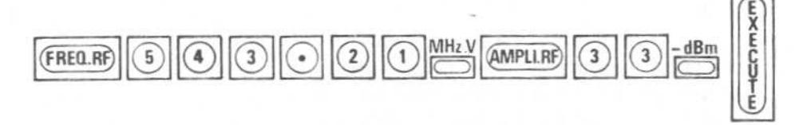

Si le signal RF est inhibé, voyant "INHIB RF" allumé, presser la touche située à côté de ce voyant pour obtenir le signal.

Nota : L'ordre d'entrée des paramètres n'est pas imposé et il est toujours possible de modifier un quelconque paramètre sans entrer de nouveau les autres.

\* Une fréquence RF avec niveau donné en volt : soit 9592 kHz, 152 mV.

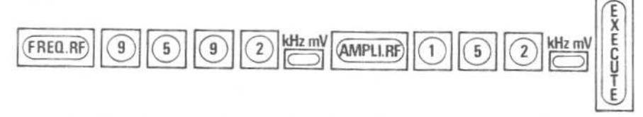

\* Niveau en dBµV : soit +20 dBµV.

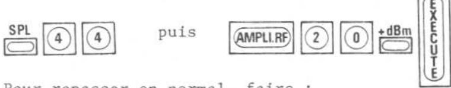

Pour repasser en normal, faire :

### PROGRAMMATION DES MODULATIONS

### \* Choix de la source :

Les touches MODULATION "EXT", "1 kHz", "400 Hz" permettent de choisir la source de modulation. La touche "0" inhibe toute modulation indépendamment du réglage de celle-ci.

En extérieur, un signal de 0.5 V eff/600 ohms doit être appliqué sur l'entrée BF. Les voyants cet permettent de vérifier la calibration ou de l'obtenir en agissant sur le niveau du signal d'entrée.

# \* Choix du type de modulation et réglage :

Exemples:

- Une fréquence RF, niveau RF et excursion FM donnés : soit 102,25 MHz, niveau lµV, déviation 75 kHz.

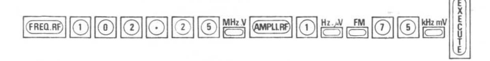

- Une fréquence RF, niveau RF et taux de modulation AM donnés : soit 225 MHz, niveau -100 dBm, taux de modulation 30%.

- Une fréquence RF, niveau RF et excursion de phase donnés : soit 30 MHz, niveau +13 dBm, excursion de phase 5,6 rd.

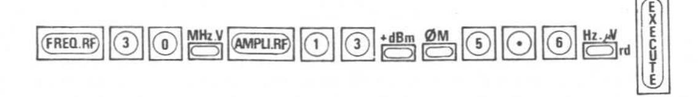

### INCREMENTATION

Chaque paramètre peut être entré sous forme d'incrément simplement en pressant, après introduction de la donnée, la touche "INC" du bloc "DONNEES".

L'incrémentation se fait ensuite au moyen des touches  "up"  et  "down"  du bloc "INCREMENT".

Exemple : Effectuer un incrément de fréquence de 12,5 kHz à partir d'une fréquence déjà entrée :

et autant de pression sur "up" ou "down" que de pas à faire.

Nota: . Une pression sur la touche "INC" permet de visualiser un incrément déjà entré. Après introduction d'un incrément, il est possible mais non indispensable de réafficher la valeur du paramètre à incrémenter en enfonçant la touche du bloc PARAMETRE correspondante; "FREQ. RF" dans l'exemple.

. en amplitude, l'incrément s'exprime uniquement en dB.

#### MANIVELLE

Pour obtenir une variation pseudo-analogique de n'importe quel paramètre, il suffit d'appeler celui-ci (voyant du paramètre allumé) et de tourner la manivelle de réglage après l'avoir validée ("VALID").

Les résolutions de départ, préréglées à chaque mise en marche de l'appareil, sont :

- Fréquence RF : 1 MHz - Amplitude RF : 0,1 dB

- Excursion FM : . de 0 à 20 kHz --> 10 Hz . de 20 à 200 kHz --> 0,1 kHz

- Excursion &M : 0,01 rd - Taux AM : 0,1 %

Cette résolution est indiquée par un clignotement du chiffre correspondant pendant 2 secondes après la validation du bouton de réglage ("VALID"). Elle peut être modifiée en rapports décimaux par les touches "x10" et ":10". En FM et &M la manivelle n'est active qu'après introduction d'une valeur de départ au clavier.

L'inhibition de la manivelle pour chaque paramètre s'obtient en pressant de nouveau la touche "VALID".

# MEMOIRES ET SEQUENCE

# \* Entrée :

Lorsqu'une configuration complète de l'appareil doit être sauvegardée, il suffit, pour entrer dans la mémoire n° 24, de faire :

ou, pour entrer dans la mémoire n° 8 :

Le numéro de la case mémoire s'inscrit fugitivement sur l'affichage fréquence sous la forme PO8 pour  $\underline{P}$ osition mémoire  $\underline{08}$ .

 $\frac{\text{Nota}}{}$ : Pour désigner une mémoire, il est indispensable d'entrer toujours  $\underline{2}$  chiffres.

# \* Sortie :

Pour rappeler une configuration en mémoire, soit la n° 13, faire :

Le numéro de mémoire s'affiche pendant 2 secondes, puis la configuration mémorisée apparaît et le voyant "EXECUTE" clignote, tandis que l'appareil reste sur la dernière configuration exécutée.

Pour exécuter la dernière configuration rappelée, faire :

Lorsque l'on rappelle une configuration mémorisée afin de vérifications sans pour cela vouloir l'exécuter, il suffit pour réafficher la configuration initialement exécutée, de presser la touche "x\*y" du bloc "DONNEES".

\* <u>Séquence</u>: Il est possible d'organiser un certain nombre de positions mémoire en une séquence qui peut être exploitée par l'intermédiaire d'une prise 9 broches située à l'arrière de l'instrument.

Un interrupteur à pédale, un cadenceur ou les touches incréments permettent alors de faire défiler les configurations pour une utilisation semi-automatique de l'appareil.

Pour cela, entrer les configurations dans la mémoire, dans l'ordre de leur numéro, et définir ensuite les limites.

Exemple : Séquence de 5 fréquences :

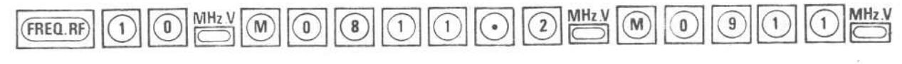

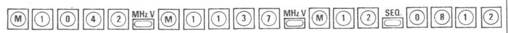

Allumage du voyant "SEQ" lors de la pression sur cette touche. Entrer rapidement les limites dès la pression sur "SEQ", l'attente ne pouvant excéder 2 secondes.

L'action sur la pédale extérieure ou sur les touches et est exécutoire.

La touche  "up"  permet d'incrémenter les mémoires et la touche  "down"  le retour au début de la séquence.

Pour l'inhibition du système, il suffit de sélectionner n'importe quel paramètre et pour sa suppression, de faire :

Lorsqu'une séquence est organisée, une pression sur la touche "SEQ" donne, sur l'affichage fréquence RF, les numéros de début et de fin de séquence pendant 2 secondes, exemple : 08-12, mais le voyant "SEQ" est allumé, sauf arrêt de l'instrument, tant que la fonction n'a pas été inhibée ou supprimée.

Tant que le voyant "SEQ" est allumé, les touches INCREMENT  "up"  et  "down"  ou un interrupteur à pédale\* connecté à la prise "AUX" permettent d'incrémenter les mémoires dans la séquence. L'exécution est faite à chaque pas.

\* Brochage sur schéma carte CPU.

### \* Recherche d'une position mémoire :

Pour rechercher, soit une mémoire libre, soit une configuration entrée dont le numéro est oublié par l'utilisateur, faire "R", donner un numéro de départ et utiliser les touches du bloc INCREMENT  "up"  et  "down"  pour faire défiler les mémoires dans un sens ou dans l'autre.

Après chaque pression, le numéro de la position mémoire s'inscrit à la place de la fréquence, mais au bout de 2 secondes environ, la configuration complète est affichée sur la face avant. Le mode n'est pas exécutoire, toute configuration retenue doit être exécutée (voyant "EXECUTE" clignotant).

Un voyant situé au-dessus de la touche "M" indique, de la même manière que les touches PARAMETRE, l'état actif de cette touche et en conséquence des touches INCREMENT  "up"  et  "down" .

# MODULATION D'IMPULSION (option)

Ce mode n'est possible qu'avec l'option modulation d'impulsion et il interdit les modulations FM et PM. Pour valider ce mode, faire :

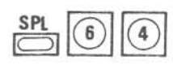

L'affichage modulation indique alors :

Les 3 chiffres restant sont disponibles pour une éventuelle modulation AM.

Pour supprimer la modulation d'impulsion, il suffit de faire :

ou de choisir un autre paramètre de modulation que l'AM. Lors de l'initialisation, la position modulation impulsion est oubliée.

# CARACTERISTIQUES PARTICULIERES DU CLAVIER

- \* Touche "C" : efface les données en cours, les incréments, la fonction séquence.
- \* Touche "Back" : permet la correction du paramètre appelé en partant du dernier chiffre entré. Un clignotement indique le chiffre qui peut être rectifié.
- \* Touche "X<->Y" : permet, lors d'une entrée Clavier, de visualiser pendant deux secondes la configuration active de l'instrument, permet de réafficher la configuration active en cas de rappel mémoire non exécuté.
- \* Touche "SPL" : Associée au clavier, cette touche permet de répondre à des besoins particuliers. Ex. : modulation d'impulsion ; unité de niveau en dBµV.

  Elle permet en outre l'initialisation de la face avant à 300 MHz et 129,9 dBm, "SPL 98".

### STATUS

Ce bloc comprend 4 voyants et un bouton poussoir :

- \* Voyant "REM"
- : (Remote) indique que l'instrument est en programmation extérieure IEEE 488.
- \* Poussoir "RTL" adresse : deux actions :

- en "Remote", permet le retour en "Local" sauf instruction "Local lock out" sur le contrôleur.

- en "Local", visualise sur l'affichage fréquence l'adresse de l'instrument, adresse qui est modifiée par un commutateur situé dans l'instrument.

La forme de l'affichage est AO3, par exemple.

- \* Voyants
  - "Normal" : tout est normal.
  - "Dépassement" : fonctionnement autorisé mais dépassement, spécification non garantie ou diminuée.
  - "Erreur" : fausse manipulation.

### Dépassement

- En dessous de 1,5 MHz le voyant dépassement s'allume pour indiquer une modification des spécifications en modulation AM.
- Le voyant dépassement s'allume également dès qu'une modulation AM est programmée, si le niveau de sortie est égal ou supérieur à + 7 dBm (risque de distorsion AM).

#### Entrée erronée

Pour toute entrée de données correspondant à des valeurs hors gamme, le voyant erreur s'allume et un code erreur apparaît sur l'affichage fréquence pendant 2 secondes environ. Après ce délai, retour à la valeur antérieure.

Le tableau ci-après donne la signification des codes erreurs :

| Fréquence RF trop grande              | E - 21 |
|---------------------------------------|--------|
| Fréquence RF trop basse               | E-22   |
| Amplitude RF trop grande              | E-41   |
| Amplitude RF trop petite              | E - 42 |
| Incrément exprimé en volts            | E - 47 |
| Taux de modulation AM trop grand      | E-61   |
| Taux de modulation AM < 0             | E-62   |
| Option modulation d'impulsion absente | E-64   |
| Excursion FM-PM trop grande           | E - 71 |
| Excursion FM-PM < 0                   | E-72   |
| FM ou PM en modulation d'impulsion    | E-74   |
| Dépassement de butée de séquence      | E-89   |
| Débordement Bus IEEE                  | E-91   |
| Unité incohérente en FM et PM         | E - 77 |
|                                       |        |

En cas d'appel d'une mémoire vide, le voyant erreur s'allume et l'affichage Fréquence affiche "E" à côté du numéro mémoire appelé.

# Omission de l'unité ou unité incohérente

En cas d'omission de l'unité, voyant ERREUR et retour à la valeur antérieure

# Oubli de sélectionner un nouveau paramètre

Ceci arrive fréquemment si l'on entre une configuration complète. Dans ce cas, pour éviter la perte de la valeur entrée sur le paramètre de départ après introduction de l'unité, le clavier n'est plus actif tant que l'on n'a pas sélectionné un paramètre ou que l'on n'a pas exécuté la configuration.

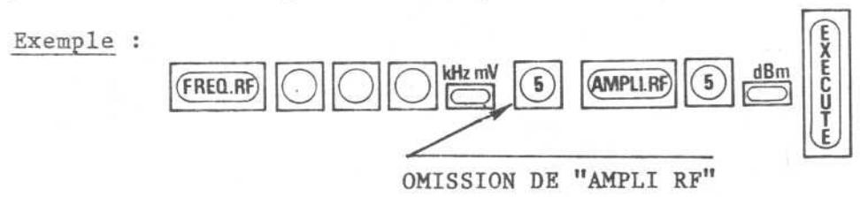

La fréquence de sortie est effectivement 123 MHz, le premier "5" tapé sans être précédé de "AMPLI RF" n'est pas pris en compte.

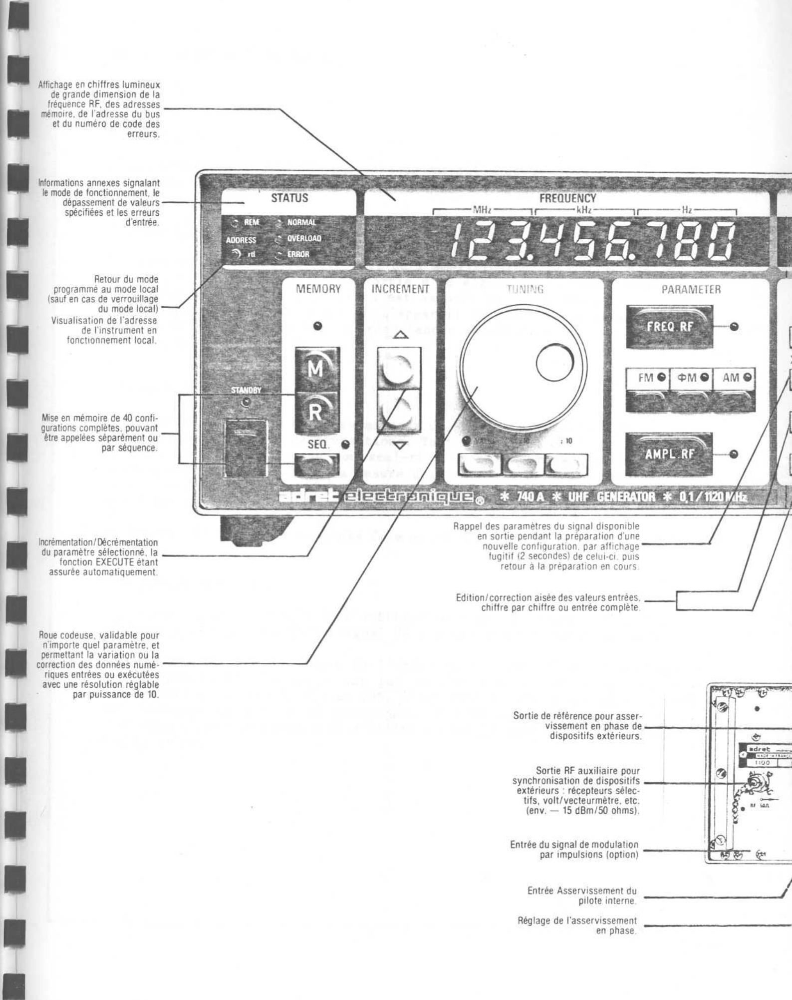
