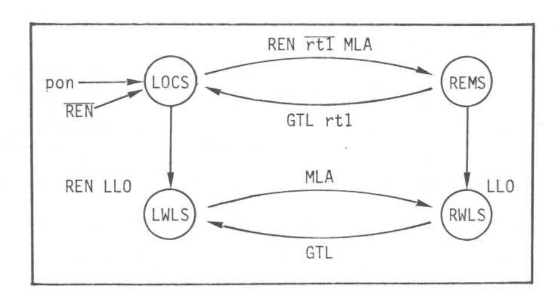
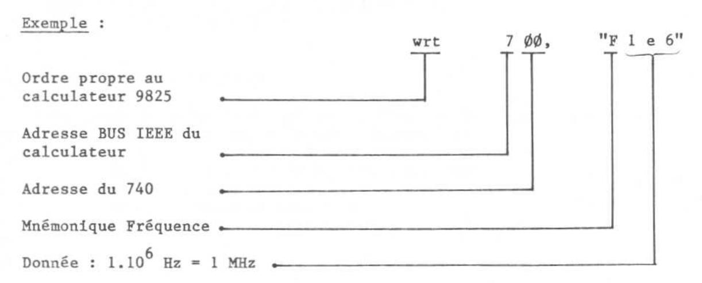
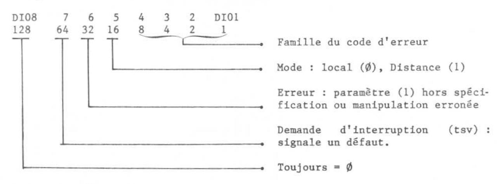
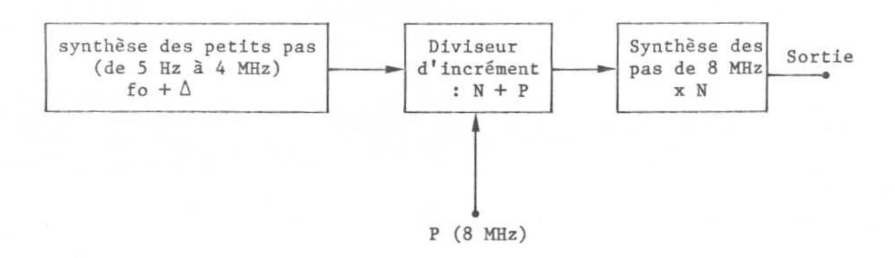

### III.5. UTILISATION DU BUS IEEE 488

### PRINCIPE

La programmation du générateur est réalisée selon la norme IEEE-488 de 1975 et utilise un LANGAGE CLAIR et un FORMAT LIBRE.

Toutes les fonctions de l'instrument sont programmables au moyen de PREFIXES MNEMONIQUES attribués à chacune des commandes du panneau avant.

Ces préfixes sont associés à un ou plusieurs chiffres pour sélectionner une commande ou définir l'entrée d'une valeur selon une procédure détaillée dans les pages qui suivent.

L'affichage du générateur reste validé en mode programmation pour permettre la vérification de la configuration introduite et exécutée par le contrôleur.

## RACCORDEMENT AU BUS, ADRESSAGE

Le connecteur normalisé est situé sur la face arrière de l'instrument et doit être raccordé au contrôleur par l'intermédiaire d'un cordon bus IEEE 488 standard.

Il est possible de connaître l'adresse sélectionnée sur le 740 en pressant le poussoir "adresse (rt1)", l'affichage se faisant en clair sur la face avant à la place de la fréquence RF.

Pour modifier l'adresse, le commutateur se situe sur le panneau arrière.

| poids pinaire NC | $\bigcirc$ |
|---------------------|------------|
| LO                  | ٠ 🔾        |
| 1 1                 | 15 CO      |
| 2 2                 | 4 0 7      |
| 4 3                 | ~ O i      |
| 8 —— 4              | ~ 🔘        |
| 16 5                | - 0        |

- Positionner l'inverseur LO (Listener Only) sur "O", position "adressable". Dans le cas contraire (LO = "l") l'appareil est adressé de façon permanente.
- Positionner les inverseurs l à 5 sur "0" ou "1" pour réaliser le chiffre binaire correspondant à l'adresse décimale choisie entre 0 et 30.

# PROGRAMMATION DES MODES LOCAL/DISTANCE

Le 740 remplit les conditions RL2 de la norme IEEE-488 qui stipule que le mode programmé peut être LOCAL ou DISTANCE avec la possibilité de verrouiller le fonctionnement de l'instrument. La fonction RL2 est schématisée par le diagramme simplifié ci-après accompagné de sa table mnémonique.

## Messages de commande

pon = mise sous tension/power on

rtl = retour local manuel/return to local

REN = valid. distance/remote enable

LLO = verrouillage du local/local lock out

GTL = retour en local/go to local
MLA = adressage/my listen address.

### Modes

LOCS = local sans verrouillage/local state

LWLS = local avec verrouillage/local with lockout state

REMS = distance sans verrouillage/remote state

RWLS = distance avec verrouillage/remote with lockout state.

Dès le raccordement du contrôleur au connecteur du panneau ARRIERE et quand le bus IEEE est actif (ligne REN à 0 Volt), l'interrupteur MARCHE/ATTENTE ne peut plus mettre l'appareil en ATTENTE, que le mode d'utilisation soit local ou distance.

# Passage en mode distance

Le mode DISTANCE est obtenu dès le premier adressage en LISTENER (écoute) de l'appareil à condition que la ligne REN soit active (REN = 0 V).

## CONSTITUTION DES MESSAGES

La programmation des différents paramètres s'effectue toujours en code ASCII, leur prise en compte par le générateur ayant lieu à la réception d'un caractère d'exécution qui joue le rôle de la touche "EXECUTE" du mode local.

Sont considérés comme caractères d'exécution le point d'interrogation, l'ordre "Groupe exécute trigger" ou le retour chariot "carriage return" (C) ou le saut de ligne "Line Feed" (LF) généralement transmis automatiquement.

L'ordre d'exécution peut être différé par l'émission d'un point d'exclamation et ceci jusqu'à réception d'un autre caractère d'exécution. Il est donc toujours possible d'enregistrer et de visualiser une configuration sans l'exécuter immédiatement.

Des exemples de programmation, correspondant à l'utilisation d'un contrôleur HP9825, sont donnés pour compléter la description et faciliter la compréhension. Toutefois, l'emploi de ce contrôleur n'est absolument pas restrictif, le générateur étant programmable à partir d'autres modèles.

Les préfixes mnémoniques de programmation peuvent être indifféremment écrits en majuscules ou minuscules.

### PROGRAMMATION DE LA FREQUENCE RF

Programmer le mnémonique "F" suivi en format libre de la fréquence exprimée en Hz. Toute fréquence exigeant une résolution supérieure à 10 Hz est arrondie par défaut à la dizaine d'Hz inférieure.

#### PROGRAMMATION DU NIVEAU DE SORTIE

Programmer le mnémonique "A" (amplitude) suivi du niveau en dBm, la résolution étant de 0,1 dB.

La programmation s'effectue obligatoirement en dBm.

exemple 1 : soit -45,2 dB. wrt 700, "A -45.2"

exemple 2 : programmation de la fréquence et du niveau, soit 118 MHz et -117 dBm.
wrt 700, "F 118 e 6 A -117"

# PROGRAMMATION DE L'INHIBITION RF

Programmer le mnémonique "RF" suivi de " $\emptyset$ " pour inhibition et "1" pour validation du niveau RF.

## PROGRAMMATION DES MODULATIONS

# \* Modulation d'amplitude

Programmer le mnémonique "AM" suivi d'un chiffre compris entre 0 et 3 pour la sélection du mode selon la table suivante :

AM 0 Inhibition de la modulation (CW)

AM 1 Source externe

AM 2 Source interne 1 kHz

AM 3 Source interne 400 Hz

Programmer le préfixe % suivi d'un nombre exprimant le taux en % avec une résolution de 0,1 %.

Exemple : source int 1 kHz et 50,5 % de taux. W 700, "AM 2 % 50.5"

# \* Modulation de fréquence

Programmer le mnémonique "FM" suivi d'un chiffre compris entre 0 et 3 pour la sélection du mode selon la table suivante :

FM 0 Inhibition de la modulation (CW)

FM 1 Source externe

FM 2 Source interne 1 kHz

FM 3 Source interne 400 Hz

Programmer le préfixe "D" (déviation) suivi d'un nombre représentant la déviation de fréquence exprimée en kHz, sachant que la résolution disponible est de :

10 Hz de 0 à 19,99 kHz 100 Hz de 20 à 199,9 kHz

Exemple : Source interne 400 Hz et 75 kHz de déviation. wrt 700, "FM3 D 75"

## \* Modulation de phase

Programmer le mnémonique "PM" suivi d'un chiffre compris entre 0 et 3 pour la sélection du mode selon la table suivante :

PMØ Inhibition de la modulation (CW)
PM1 Source externe
PM2 Source interne 1 kHz
PM3 Source interne 400 Hz

Programmer le préfixe "P" suivi du nombre exprimant la déviation en radians

Exemple : Source ext. et déviation de  $\pm$  3,14 rd wrt 700, "PM1 P 3.14"

# \* Modulation d'impulsion

avec la résolution de 0,01 rd.

Programmer le préfixe mnémonique "SL 64" (spécial 64) pour valider le mode. Suppression de la modulation d'impulsion : "SL 60".

## PROGRAMMATION DES MEMOIRES

Introduire la configuration dans une mémoire en programmant le mnémonique "M" suivi du n° d'ordre de la mémoire choisie, de  $\emptyset$ l à  $4\emptyset$ .

Rappeler une configuration mise en mémoire au moyen du mnémonique "RM" (rappel mémoire) suivi du n° de la mémoire.

### PROGRAMMATION DES SEQUENCES

Programmer le mnémonique "SQ" suivi de 4 chiffres déterminant les bornes de la séquence.

Exemple: wrt 700, "SQ 05 23"

La séquence ainsi déterminée contient les mémoires de n° 05 à 23 et l'action ultérieure sur la pédale ou les touches  $\triangle$  et  $\bigcirc$  du bloc Incrément permettra de l'exploiter après retour en local.

Pour supprimer la séquence, faire : "SQØ".

## TRAITEMENT DES ERREURS

\* Status (lecture des états).

L'appareil remplit la fonction SRl de la norme IEEE-488 en émettant le signal SRQ (service request ou demande d'interruption) sur le BUS, à la suite de la tentative de dépassement des spécifications d'entrée.

Le contrôleur peut alors demander un octet d'état (status byte) selon le procédé de reconnaissance série (serial polling). Le format de l'octet est le suivant :

La validation du bit 32 signale une erreur d'utilisation. La famille du code d'erreur correspondant à la faute commise est indiquée par les bits BCD 1-2-4-8 (0 à 9), l'affichage du générateur visualisant le code exact ( $\emptyset\emptyset$  à 91).

## \* Fonction d'interface

Le 740 est conforme à la norme IEEE 488-1975 et à la norme CEI 625-1 à l'exception du connecteur qui est celui de la norme IEEE. Une adaptation du connecteur CEI est possible sur demande. Le 740 remplit les fonctions suivantes :

AH1 - SH1 - T2 - TEØ - L1 - LEØ - RL1 - PPØ - DC1 - DT1 - CØ.

# CHAPITRE IV PRINCIPE DE FONCTIONNEMENT

### PRINCIPE GENERAL

Le générateur à synthèse de fréquence 740 met en oeuvre un procédé nouveau et original qui permet d'obtenir une excellente pureté spectrale tout en diminuant considérablement le nombre d'éléments nécessaires à la réalisation des parties fonctionnant en VHF.

Le procédé nouveau, breveté en France (n° 80 27 872) et à l'étranger, concerne la synthèse des plus grands pas, c'est-à-dire pour le 740, des pas de 8 MHz.

D'une manière très simplifiée, le principe du 740 peut être représenté comme ci-dessous :

