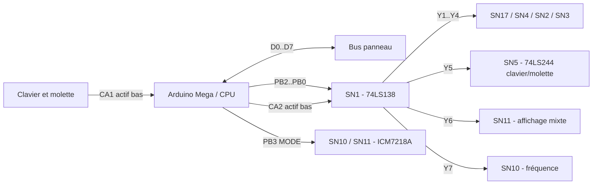
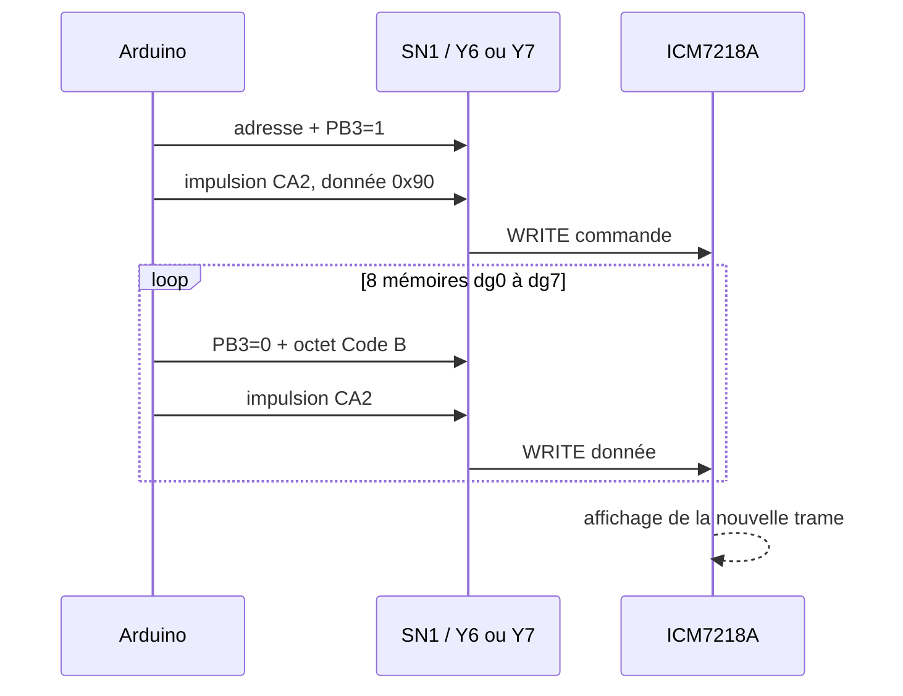
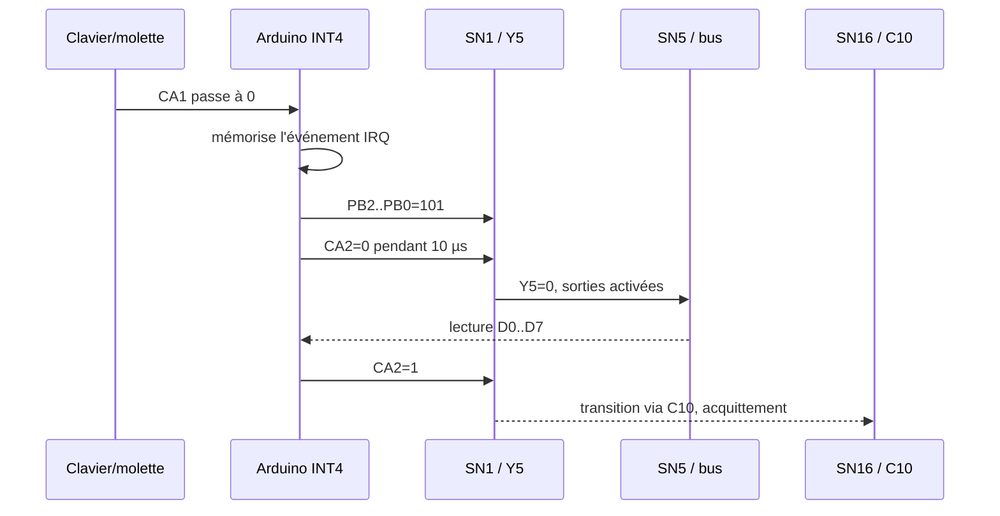
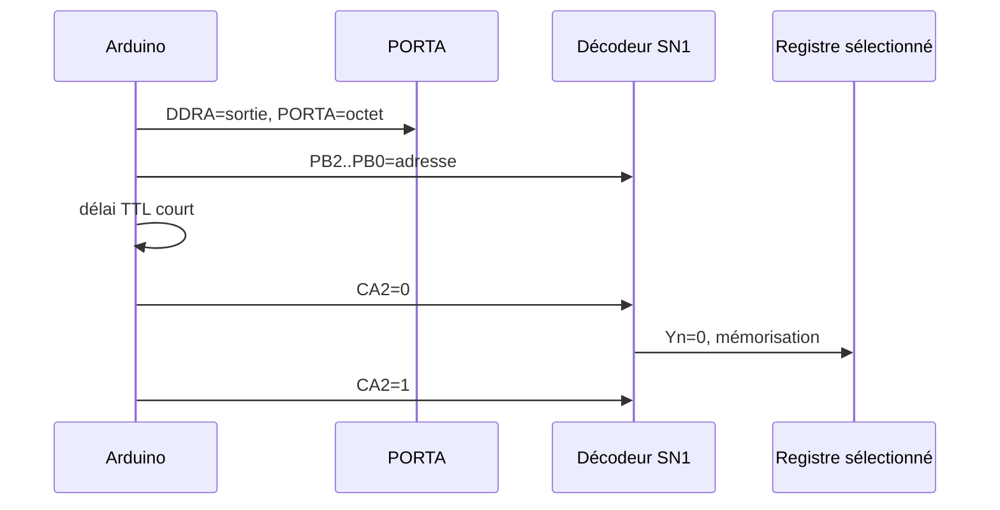

# Rétroanalyse du panneau avant ADRET 740A

Ce document rassemble la compréhension actuelle du panneau avant de l'ADRET
740A et de son remplacement de carte CPU par une Arduino Mega 1280 ou 2560. Il
décrit le matériel d'origine, le protocole observé sur le connecteur CPU et la
manière dont le firmware reproduit ce protocole.

## Niveaux de certitude

Les indications suivantes sont utilisées dans tout le document :

- **Confirmé au banc** : observé sur le panneau réel avec le firmware actuel.
- **Déduit du schéma** : conséquence directe du schéma, mais pas toujours
  mesurée sur chaque nœud du circuit.
- **À valider** : hypothèse plausible ou fonction non encore caractérisée.

## Sources

- [Schéma du panneau avant](Adret%20740A%20Panneau%20avant_schema.pdf)
- [Table mémoire du panneau](Adret_740A_table_memoire_panneau_avant.ods)
- [Mapping détaillé du connecteur](CONNECTEUR_PANNEAU_MAPPING.md)
- [Matrice clavier](MATRICE_CLAVIER.md)
- [Cartographie matérielle synthétique](HARDWARE_MAP.md)
- [`FrontPanelMap.h`](../include/Adret/FrontPanelMap.h)
- [`HardwareConfig.h`](../include/Adret/HardwareConfig.h)
- [`FrontPanelBus.cpp`](../src/FrontPanelBus.cpp)
- [Datasheet ICM7218A, Renesas](https://www.renesas.com/en/document/dst/icm7218-datasheet)

## 1. Architecture générale

**Confirmé au banc.** Le panneau communique avec la CPU par :

- un bus bidirectionnel de huit bits, nommé `PA0..PA7` ou `D0..D7` ;
- trois bits d'adresse `PB2..PB0` ;
- un bit de mode `PB3` réservé aux ICM7218A ;
- `CA2`, validation active à l'état bas du décodeur d'adresse ;
- `CA1`, demande d'interruption active à l'état bas pour le clavier et la
  molette ;
- une ligne séparée `INHIB` pour la commande générale d'alimentation.

SN1 est un 74LS138. Ses sorties `Y0..Y7` sont actives à l'état bas. Une
adresse n'est donc effective que pendant l'activation de `CA2`.

## 2. Câblage validé vers l'Arduino Mega

### 2.1 Bus de données

**Confirmé au banc.** Le faisceau réel croise chaque paire de broches Arduino.
Ces croisements ont été établis en comparant tous les codes de la matrice
clavier, puis confirmés par les voyants et les afficheurs.

| Signal panneau | Port AVR reçu/piloté | Nom Arduino | N° imprimé PCB |
| --- | --- | --- | ---: |
| `D0 / PA0` | `PA1` | `D23` | **23** |
| `D1 / PA1` | `PA0` | `D22` | **22** |
| `D2 / PA2` | `PA3` | `D25` | **25** |
| `D3 / PA3` | `PA2` | `D24` | **24** |
| `D4 / PA4` | `PA5` | `D27` | **27** |
| `D5 / PA5` | `PA4` | `D26` | **26** |
| `D6 / PA6` | `PA7` | `D29` | **29** |
| `D7 / PA7` | `PA6` | `D28` | **28** |

Le firmware accède toujours à l'octet complet avec `PORTA`, `PINA` et `DDRA`.
Les permutations sont réalisées par le faisceau et ne sont pas réappliquées
aux octets de voyants ou d'affichage.

### 2.2 Sélection et contrôle

| Signal panneau | Port AVR | Arduino | Sens Mega | Fonction |
| --- | --- | ---: | --- | --- |
| `PB0` | `PB0` | **53** | sortie | adresse bit 0 |
| `PB1` | `PB1` | **52** | sortie | adresse bit 1 |
| `PB2` | `PB2` | **51** | sortie | adresse bit 2 |
| `PB3` | `PB3` | **50** | sortie | MODE ICM7218A |
| `CA2` | `PB4` | **10** | sortie | validation active bas |
| `CA1` | `PE4 / INT4` | **2** | entrée | IRQ active bas |

Serial0, broches Arduino 0 et 1, est réservé au protocole de télécommande
série.

## 3. Décodage des périphériques

**Confirmé au banc.** L'association correcte des sorties Y6/Y7 a été trouvée
en observant les trames numériques : elle est inversée par rapport à la
première hypothèse issue de la table de travail.

| PB2 | PB1 | PB0 | Sortie SN1 | Circuit | Fonction |
| ---: | ---: | ---: | --- | --- | --- |
| 0 | 0 | 0 | Y0 | — | repos |
| 0 | 0 | 1 | Y1 | SN17 | points dédiés |
| 0 | 1 | 0 | Y2 | SN4 | premiers caractères et états |
| 0 | 1 | 1 | Y3 | SN2 | voyants fonction/unité/source |
| 1 | 0 | 0 | Y4 | SN3 | voyants état/mode/mémoire |
| 1 | 0 | 1 | Y5 | SN5 | lecture clavier et molette |
| 1 | 1 | 0 | Y6 | SN11 | fin fréquence, modulation, amplitude |
| 1 | 1 | 1 | Y7 | SN10 | huit premiers digits de fréquence |

`PB3=0` indique une donnée ICM7218A ; `PB3=1` indique un mot de commande.

## 4. Registres de voyants et caractères spéciaux

### 4.1 SN2 sélectionné par Y3

SN2 reçoit trois champs décodés. Dans chaque champ, une seule sortie physique
peut être sélectionnée à la fois.

| Bits | Champ | Codes validés |
| --- | --- | --- |
| D7..D5 | fonction | 3=`RF`, 4=`FM`, 5=`PM`, 6=`AM`, 7=`AMPLITUDE` |
| D4..D2 | unité amplitude | 0=`dBm`, 1=`dB`, 2=`dBµV`, 3=`V`, 4=`mV`, 5=`µV`, 6/7=aucune |
| D1..D0 | source modulation | 0=`400 Hz`, 1=`1 kHz`, 2=`EXT`, 3=`CW` |

**Conséquence matérielle.** Les API peuvent nommer chaque voyant séparément,
mais allumer un membre d'un groupe remplace nécessairement le précédent.

### 4.2 SN3 sélectionné par Y4

| Bits | Champ | Codes |
| --- | --- | --- |
| D7..D6 | état | 0=aucun, 1=`ERROR`, 2=`DEPT`, 3=`NORMAL` |
| D5..D4 | unité modulation | 0=aucune, 1=`rd`, 2=`kHz`, 3=`%` |
| D3..D2 AVR | voyant `EXEC` | 0=`clignotant`, 1=`éteint`, 2=`fixe`, 3=`éteint` |
| D1 AVR | indépendant actif bas | voyant `MEM` |
| D0 AVR | indépendant actif bas | voyant `SEQ` |

Ce mapping a été corrigé après validation au banc : l'activation logique de
`MEM` doit mettre D1 à zéro et celle de `SEQ` doit mettre D0 à zéro.

Ce codage inclut le croisement D2/D3 du faisceau et a été relevé au banc avec
un balayage des quatre valeurs brutes. Le firmware utilise le code 1 pour
éteindre le voyant ; le code 3, également éteint au banc, reste inutilisé.

### 4.3 SN4 sélectionné par Y2

SN4 pilote des segments ou indicateurs indépendants.

| Bit | Nom firmware | Fonction comprise |
| ---: | --- | --- |
| D0 AVR | `kModulationOne` | caractère spécial modulation `1` |
| D1 AVR | `kModulationP` | caractère spécial modulation `P` ; avec D0, aspect `A` |
| D2 AVR | `kPowerOneBlank` | extinction active haut du `1` d'amplitude |
| D3 AVR | `kPowerPlus` | signe plus amplitude |
| D4 AVR | `kPowerMinus` | signe moins amplitude |
| D5 | `kRemote` | indicateur `REM`, actif à l'état bas |
| D6 | `kRfInhibit` | indicateur lumineux `INHIB RF`, actif à l'état bas |
| D7 | `kManualValidation` | indicateur `VALID MAN` |

Ces affectations sont celles observées au banc après les permutations par
paires du faisceau ; elles diffèrent donc de la numérotation physique D0..D4
du registre SN4 donnée dans la table mémoire.

L'indicateur de façade `INHIB RF` piloté ici ne doit pas être confondu avec la
touche `RF OFF` lue dans SN5, ni avec la ligne d'alimentation `INHIB`.

Le voyant `REM` est éteint par défaut en maintenant SN4/D5 à 1. Il est piloté
par le mode distant sur Serial0 ; aucune interface GPIB matérielle n'est prévue
sur la nouvelle carte CPU.

### 4.4 SN17 sélectionné par Y1

| Bit | Fonction |
| ---: | --- |
| D0 | point suivant le premier caractère modulation |
| D1 | point suivant le premier caractère amplitude |
| D7..D2 | non utilisés dans le firmware actuel |

Ces deux points sont séparés des points intégrés dans les digits ICM7218A.
Ils sont actifs à l'état bas : SN17 doit donc recevoir `1` pour les éteindre.
Cette polarité a été confirmée lors des premiers essais de la logique
fonctionnelle.

## 5. Afficheurs numériques

### 5.1 Répartition physique

**Confirmé au banc.** Deux ICM7218A commandent seize positions numériques :

- SN10/Y7 : huit premiers digits de la fréquence ;
- SN11/Y6 : deux derniers digits de fréquence, trois digits de modulation et
  trois digits d'amplitude.

Les afficheurs modulation et amplitude possèdent chacun une quatrième position
spéciale, réalisée par SN4 et SN17 plutôt que par l'ICM7218A.

| Mémoire SN11 | Position physique |
| --- | --- |
| dg7..dg6 | deux derniers digits de fréquence |
| dg5..dg3 | trois digits de modulation |
| dg2..dg0 | trois digits d'amplitude |

### 5.2 Protocole ICM7218A

Une actualisation complète suit cette séquence :

1. sélectionner SN10 ou SN11 ;
2. placer `PB3=1` et écrire la commande `0x90` ;
3. placer `PB3=0` ;
4. écrire exactement huit octets de données ;
5. l'ICM charge automatiquement ses mémoires de `dg0` à `dg7`.

`0x90` signifie : fonctionnement normal, décodage Code B et huit données à
venir. Les trames sont construites dans l'ordre électrique, donc à l'inverse
de la lecture visuelle gauche-vers-droite.

### 5.3 Points décimaux ICM

**Confirmé par datasheet et au banc.** Le point décimal est actif à zéro :

- `ID7=0` : point allumé ;
- `ID7=1` : point éteint.

Le firmware ajoute donc `0x80` à chaque chiffre Code B pour éteindre les points
pendant le test actuel. Un futur masque de points devra retirer ce bit
uniquement pour les positions voulues.

En mode sans décodage, l'ordre des segments n'est pas l'ordre sept segments
habituel. La table 1 de la documentation ICM7218 donne la correspondance
`ID6..ID0 = a, b, c, e, g, f, d`. Le générateur de glyphes du message de
démarrage applique explicitement cette permutation.

## 6. Clavier

### 6.1 Chaîne matérielle

**Déduit du schéma.** Le clavier utilise :

- SN12, 4028 : sélection des colonnes `X0..X7` ;
- SN13, 4520 : compteur de balayage ;
- SN14, 4532 : encodeur prioritaire des lignes `Y0..Y5` ;
- SN15, 4001 : logique/oscillateur associé au balayage ;
- SN5, 74LS244 : mise des codes X/Y et molette sur le bus CPU.

Le signal `Eout` de SN14 participe à la détection d'une touche et au maintien
d'un code stable. C15 couple cette détection au compteur SN13.

### 6.2 Matrice validée

| Y \ X | X0 | X1 | X2 | X3 | X4 | X5 | X6 | X7 |
| --- | --- | --- | --- | --- | --- | --- | --- | --- |
| Y5 | AMPL | — | — | — | — | — | — | ADR RTL |
| Y4 | RF | SPL | 0 | 5 | MHz | CW | ÷10 | MEM |
| Y3 | FM | X→Y | 1 | 6 | kHz | EXT | VALID MAN | SEQ |
| Y2 | PM | ← | 2 | 7 | Hz | 1kHz | ×10 | RAPPEL |
| Y1 | AM | CLEAR | 3 | 8 | dBm | 400Hz | EXEC | ↑ |
| Y0 | — | POINT | 4 | 9 | 1dBm | RF OFF | INC | ↓ |

### 6.3 Octet SN5 et traitement logiciel

| Bits reçus par la Mega | Fonction |
| --- | --- |
| bit 0..2 | code X |
| bit 3..5 | code Y |
| bit 7 | comptage molette, après permutation du faisceau D6/D7 |
| bit 6 | sens molette, après permutation du faisceau D6/D7 |

Lorsqu'il ne s'agit pas d'une impulsion de molette, `(X,Y)` est converti en
une touche nommée. Les positions absentes de la matrice sont ignorées. Deux
événements identiques séparés de moins de 30 ms sont considérés comme un
rebond. La FIFO statique peut contenir huit événements.

## 7. Molette et interruption CA1

### 7.1 Génération de CA1

**Déduit du schéma et partiellement confirmé à l'oscilloscope.** SN16, un 4027
à deux bascules JK, traite les signaux de la molette. Les chemins clavier et
molette attaquent la base de Q1 par R24 et R23. Q1, un NPN MPS2369, force CA1 à
la masse. R35, 4,7 kΩ, rappelle CA1 au +5 V.

CA1 est donc active à l'état bas. La Mega utilise `PE4/INT4`, un pull-up interne
complémentaire et une interruption sur front descendant.

La molette produit des impulsions CA1 basses mesurées entre 8 et 13 µs. Le sens
logique final gauche/droite reste **à valider**.

### 7.2 Lecture et acquittement SN5

C10, 100 pF, relie le chemin de sélection Y5 aux entrées Clear de SN16. La
lecture SN5 ne se limite donc pas à placer les données sur le bus : sa
transition participe aussi à l'acquittement de la molette.

**Confirmé au banc.** Une impulsion trop courte rendait le clavier instable.
Le maintien de Y5/CA2 pendant 10 µs a nettement amélioré son fonctionnement.

### 7.3 Cas particulier du démarrage

Si CA1 est déjà basse lorsque l'interruption sur front descendant est armée,
aucun nouveau front ne peut lancer la première lecture. Le firmware effectue
donc quatre lectures SN5 espacées de 20 µs avant d'activer INT4. Cette séquence
libère un événement resté mémorisé pendant le reset.

## 8. Séquences électriques CPU

### 8.1 Écriture d'un registre SN2/SN3/SN4/SN17

### 8.2 Retour après lecture SN5

Après la lecture, le firmware :

1. relâche CA2 ;
2. remet l'adresse sur Y0/repos ;
3. replace PORTA en sortie ;
4. écrit `0x00` sur le bus au repos.

## 9. Alimentation et signaux à ne pas confondre

### 9.1 INHIB général

**Confirmé fonctionnellement, interface Mega à valider.** La ligne dédiée
`INHIB` commande l'alimentation générale après branchement secteur :

- `0 V` : alimentation en fonction ;
- `5 V` : alimentation arrêtée.

Le bouton marche/arrêt agit sur cette ligne. La carte d'origine permettait
aussi une commande par le GPIB, qui ne sera pas reprise. La broche Mega et le
type de sortie, directe ou collecteur ouvert, restent à définir. Un rappel vers
l'arrêt doit garantir un état sûr pendant le bootloader et les resets.

### 9.2 RF OFF / INHIB RF

`RF OFF` sur le schéma et `INHIB RF` sur la sérigraphie désignent la même
touche de la matrice. Elle ne coupe que la sortie RF. Son indicateur lumineux
est piloté séparément par SN4/D6.

### 9.3 PA, présence alimentation

**Schéma validé, essai de coupure à réaliser.** Le document
[fonctionnement_interface.md](fonctionnement_interface.md) mentionne une ligne
`PA`, présence alimentation, sur le bus instrument. Elle prévient la CPU d'une
coupure afin de sauvegarder les paramètres.
Cette ligne ne fait pas partie du bus panneau `PA0..PA7` malgré l'homonymie et
le firmware utilise Arduino D3 / PE5 / INT5. Les schémas alimentation, châssis
et CPU montrent `PRESENCE ALIM (1)` en sortie 35, puis une liaison directe de
`PA` vers l'entrée `NMI` du 6802. Le signal, normalement haut, provient du
détecteur/pont de l'alimentation et non d'une tension brute : aucune résistance
série supplémentaire n'est nécessaire dans le câblage nominal. D3 est activée
en entrée haute impédance sans pull-up ; le front descendant déclenche la
sauvegarde EEPROM à deux slots et CRC. `saveNow()` reste disponible pour les
essais sans coupure.

## 10. Anomalies rencontrées et conclusions

| Observation | Cause trouvée | Correction |
| --- | --- | --- |
| Voyants figés, clavier incohérent | mauvais contact CA2 | reprise du câblage CA2 |
| Codes clavier systématiquement faux | quatre paires du bus inversées | faisceau 23/22, 25/24, 27/26, 29/28 |
| CA1 basse au démarrage | événement présent avant armement du front | quatre acquittements SN5 au boot |
| Clavier nettement plus stable avec impulsion longue | Y5/CA2 initialement trop bref | maintien SN5 pendant 10 µs |
| Trame modulation répétée sur la fréquence | SN10 et SN11 intervertis | SN11=Y6, SN10=Y7 |
| Tous les points ICM allumés | bit DP actif à zéro | données Code B avec `ID7=1` |
| Touches doublées ou positions inconnues | rebonds/transitions de scan | rejet des inconnues et filtre 30 ms |
| Clavier perdu après permutation D6/D7 | ligne sens prise pour comptage | interprétation AVR bits 7/6 corrigée |
| Clavier/molette parfois figés après une touche | CA1 peut rester basse après l'acquittement | diagnostic et quatre acquittements SN5 supplémentaires bornés |
| Environ 8 s avant la bannière après `STD BY` | câble USB relié au PC, attente du bootloader Mega/UART0 avant le firmware | aucun défaut panneau ; délai absent câble USB débranché |

## 11. État validé et travaux restants

### Confirmé au banc

- sélection des registres et polarité CA2 ;
- câblage des huit bits de données ;
- balayage des groupes de voyants ;
- matrice et libellés du clavier ;
- trames Code B SN10/SN11 et ordre des groupes numériques ;
- polarité active bas des points décimaux ICM ;
- amélioration du clavier par lecture SN5 de 10 µs et acquittements au boot ;
- délai avant bannière attribué au bootloader/USB de la Mega et non à CA1.

### À valider ou compléter

- sens définitif de la molette et robustesse de son comptage ;
- comportement CA1 sur de nombreux démarrages à froid ;
- validation au banc du placement individuel des points décimaux ;
- combinaisons exactes des premiers caractères SN4 ;
- affectation et étage électrique de la commande `INHIB` ;
- validation au banc de la tension et du délai de sauvegarde lors d'une coupure
  réelle sur la présence alimentation `PA` ;
- validation de la première logique fonctionnelle de l'instrument.
